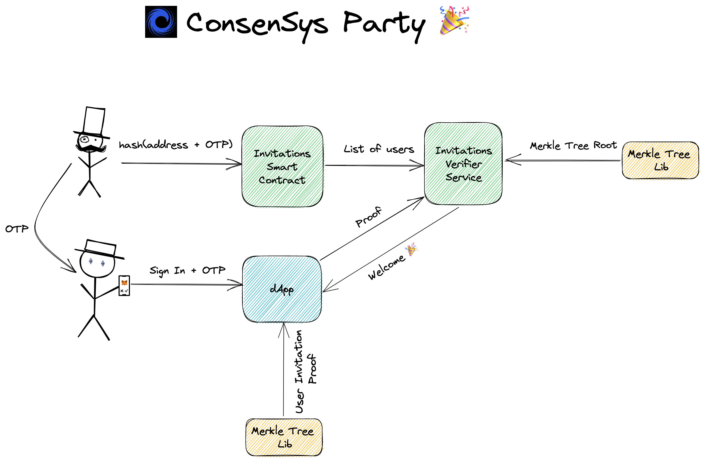
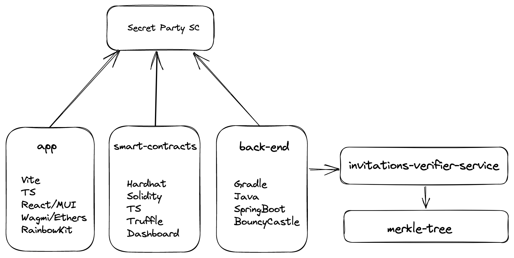
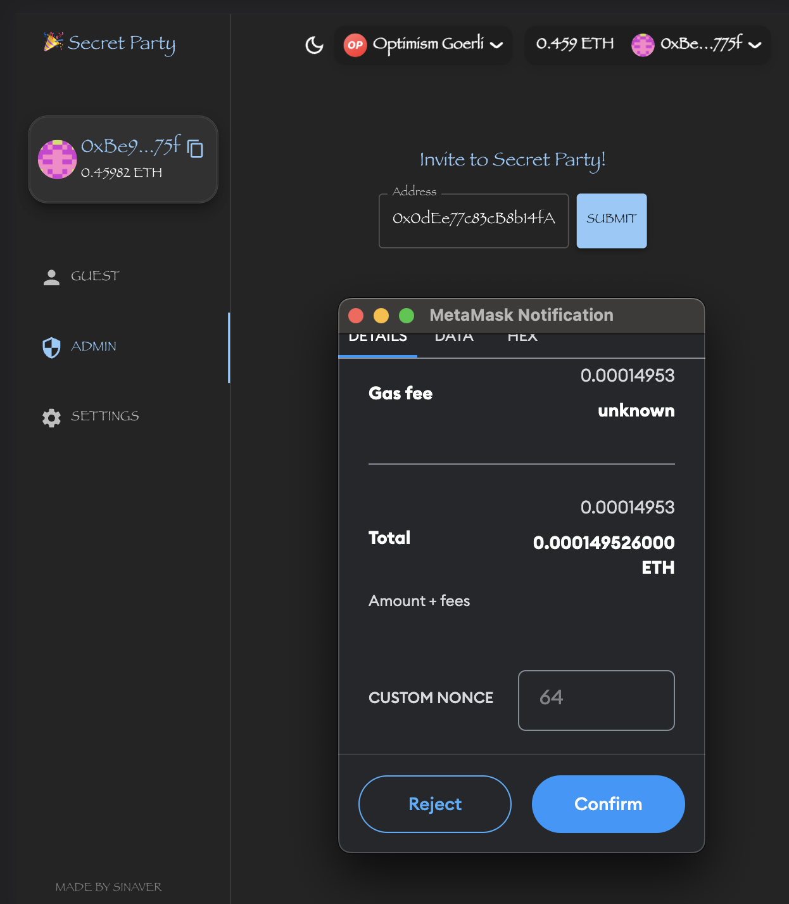
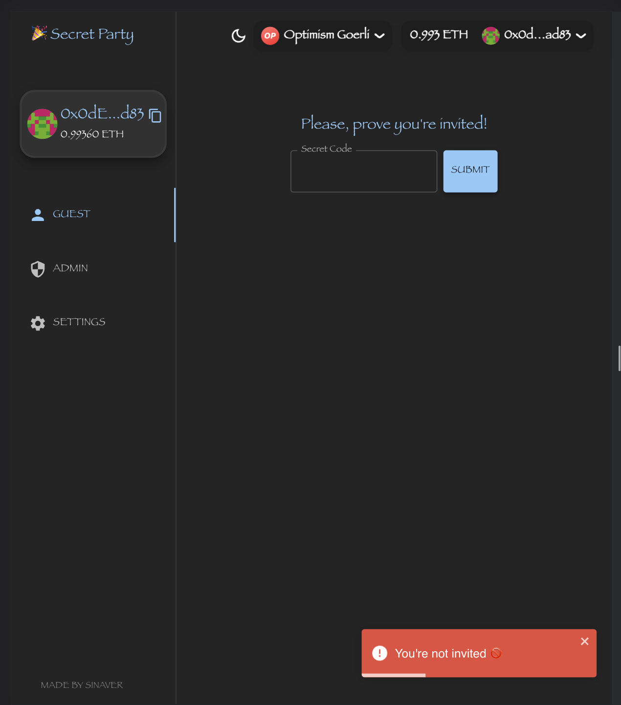
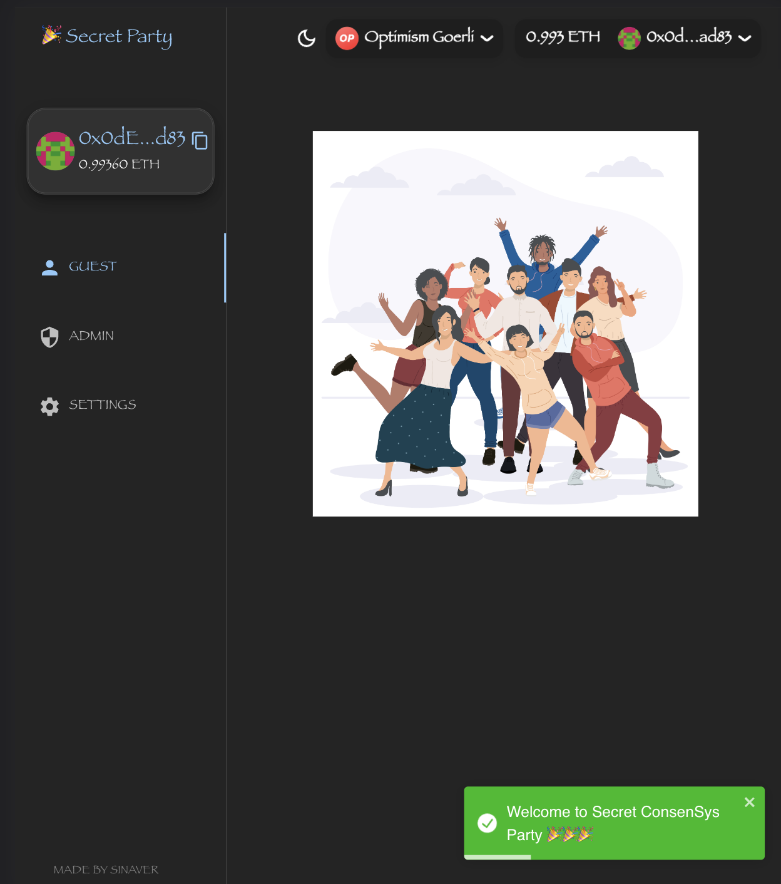

## ConsenSys Secret Party 🎉

<aside>
💡 **Secret Party** - is a dApp which allows you to invite your ConsenSys colleagues to a secret party without revealing to the public who was invited, and still preserving decentralisation and openness to verification. This is mainly achieved by using commitment cryptographic primitive. Invitations are stored as a hash of user address + random secret code on the blockchain. In order to enter the party, a user needs to reveal his secret code in order to provide proof for Merkle Tree, which includes a commitment to all invitations.

</aside>

### High-Level Design



### Building & running the project

The project source code can be found here:

[https://github.com/sidrisov/consensys-secret-party](https://github.com/sidrisov/consensys-secret-party)



1. Application
    
    ```bash
    # make sure to populate .env (.env_example for reference)
    # run dApp on localhost:5173
    cd app; npm install; npx vite dev
    ```
    
2. Smart Contracts
    
    ```bash
    # install dependencies & compile smart contract
    cd smart-contracts; npm install; npx hardhat compile
    
    # run truffle dashboard (so we can deploy smart contract 
    # with an external wallet, like Metamask)
    truffle dashboard
    
    # deploy smart contract
    npx hardhat run scripts/deploy.ts --network truffleDashboard
    ```
    
3. Server
    
    ```bash
    # you need to install JRE_19/20 and export $JAVA_HOME
    cd server/services/invitations-verifier-service
    # run invitation-verifier-service on localhost:8080
    gradle bootRun
    # OR
    ./gradlew bootRun
    
    # merkle-tree library dependency is included in the service build, 
    # but if you want to build it separately:
    cd server/libraries/merkle-tree
    gradle build -i
    # OR
    ./gradlew build -i
    ```
    

### UI/UX

1. Inviting User
    
    
    
    Once the user is invited (added on blockchain), we can see the code and root Merkle hash updated, sharing the code with a user is out of scope, let’s assume there is an existing channel it’s shared by admin with user: 
    
    ```bash
    2023-05-08T13:50:48.050+04:00  INFO 319 --- [nio-8080-exec-5] .s.InvitationsVerifierServiceApplication : Generated Code 286993 for address 0x0dEe77c83cB8b14fA95497825dF93202AbF6ad83
    2023-05-08T13:51:26.716+04:00  INFO 319 --- [nio-8080-exec-7] .s.InvitationsVerifierServiceApplication : Merle Tree Root was updated to 933c4727a46143c8dd03315499a4e714a688c3403d0d5da3c8d529c1b1d0035a
    ```
    
2. Invitation Verification
    1. User enters a wrong code
        
        
        
    2. User enters the correct code:
        
        

